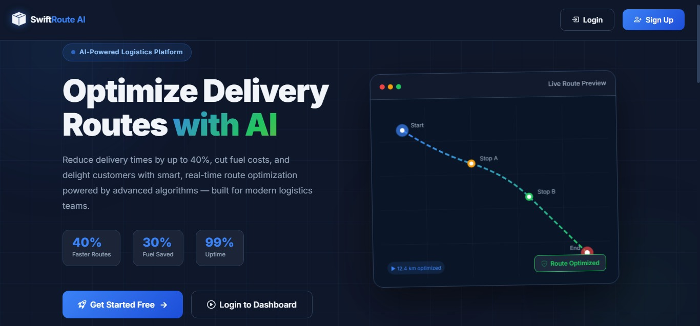

<!-- markdownlint-disable MD033 MD041 -->
<div align="center">

# Smart Route Delivery Planner

<p align="center">

</p>

*A.I-Powered Delivery Route Optimization Platform*

[](https://developer.mozilla.org/en-US/docs/Web/HTML)
[](https://developer.mozilla.org/en-US/docs/Web/CSS)
[](https://developer.mozilla.org/en-US/docs/Web/JavaScript)
[](https://python.org)
[](https://fastapi.tiangolo.com)
[](https://vercel.com)
[](LICENSE)
[](https://github.com/Blue-Rangoon/wpm-typing-test)

[](https://github.com/Blue-Rangoon/Smart-Delivery-Route-Planner-AI/commits/main)
[](https://github.com/Blue-Rangoon/Smart-Delivery-Route-Planner-AI/stargazers)
[](https://github.com/Blue-Rangoon/Smart-Delivery-Route-Planner-AI/graphs/contributors)

</div>

---



---

## 📋 Table of Contents

- [About The Project](#about-the-project)
- [⭐ Repository Visitors](#-repository-visitors)
- [✨ Features](#-features)
- [🛠️ Tech Stack](#️-tech-stack)
- [🚀 Getting Started](#-getting-started)
  - [Prerequisites](#prerequisites)
  - [Installation](#installation)
  - [Running the Application](#running-the-application)
- [📖 API Documentation](#-api-documentation)
- [🗺️ Available Nodes](#-available-nodes)
- [🔐 Security Notes](#-security-notes)
- [🤝 Contributing](#-contributing)
- [📄 License](#-license)
- [❤️ Made with Love](#️-made-with-love)

---

## About The Project

AI-powered delivery route optimization platform built with Flask. This application calculates optimal delivery routes using advanced pathfinding algorithms (A*, UCS, Dijkstra, BFS, DFS), reducing delivery times by up to **40%** and cutting fuel costs.

Built specifically for Karachi's delivery network, Smart Route Delivery Planner helps logistics teams optimize their delivery routes with real-time map visualization, smart traffic intelligence, and comprehensive analytics.

> 💡 **Live Demo:** [Smart Route Delivery Planner](https://smart-delivery-route-planner-ai.vercel.app/) *(Live Website)*

---

## ⭐ Repository Visitors

<div align="center">


*Thank you for visiting! If you find this project useful, please consider giving it a ⭐*

</div>

---

## ✨ Features

| Feature | Description |
|---------|-------------|
| 🧠 **AI Route Optimization** | Dijkstra/A*/UCS-powered algorithms for shortest, fastest, and most fuel-efficient routes |
| 🗺️ **Live Map Visualization** | Interactive Leaflet maps with real Karachi coordinates and animated route drawing |
| 🚦 **Smart Traffic Intelligence** | Options for speed, fuel efficiency, or road quality optimization |
| 📊 **Delivery Analytics** | Track distance, ETA, and cost summaries for every delivery run |
| 📱 **Mobile Responsive** | Fully responsive dashboard for phones, tablets, and desktops |
| 🔒 **Secure Authentication** | Local-first authentication with encrypted user sessions |
| 🎯 **Multiple Algorithms** | Choose from A*, Uniform Cost Search, Dijkstra, BFS, or DFS |
| ⚡ **Real-time Updates** | Instant route calculation and visualization |

---

## 🛠️ Tech Stack

### Frontend


### Backend


### Libraries & Frameworks


### Algorithms


---

## 🚀 Getting Started

### Prerequisites

- **Python 3.8** or higher
- **pip** (Python package manager)

### Installation

#### 1. Clone the Repository
```bash
git clone https://github.com/Blue-Rangoon/smart-route-delivery-planner.git
cd smart-route-delivery-planner
```

#### 2. Create Virtual Environment (Recommended)
```bash
# Windows
python -m venv venv
venv\Scripts\activate

# macOS / Linux
python3 -m venv venv
source venv/bin/activate
```

#### 3. Install Dependencies
```bash
pip install -r requirements.txt
```

### Running the Application

```bash
python app.py
```

The application will start on **http://localhost:5000**

---

## 📖 API Documentation

| Endpoint | Method | Description |
|----------|--------|-------------|
| `/api/signup` | POST | Register a new user account |
| `/api/login` | POST | User authentication |
| `/api/logout` | POST | User logout |
| `/api/locations` | GET | Get all node locations |
| `/api/nodes` | GET | Get all available nodes |
| `/api/plan_route` | POST | Plan optimal route between two points |
| `/api/graph` | GET | Get graph data |

### Example: Plan a Route

```bash
curl -X POST http://localhost:5000/api/plan_route \
  -H "Content-Type: application/json" \
  -d '{
    "start": "A",
    "end": "H",
    "options": ["traffic", "fuel"]
  }'
```

---

## 🗺️ Available Nodes

The system includes delivery locations across **Karachi, Pakistan**:

| Code | Location | Area |
|------|----------|------|
| A | UIT University | Gulshan Block 7 |
| B | Gulshan Chowrangi | Gulshan-e-Iqbal |
| C | NIPA Chowrangi | Gulshan-e-Iqbal |
| D | Liaquatabad | Liaquatabad |
| E | Teen Hatti | Saddar |
| F | Guru Mandir | Saddar |
| G | MA Jinnah Road | Karachi South |
| H | Saddar Karachi | Saddar |

---

## 🔐 Security Notes

- ⚠️ The default secret key in `app.py` is for **development only**
- In production, generate a secure secret key:
  ```bash
  python -c "import secrets; print(secrets.token_hex(32))"
  ```
- Update the `app.secret_key` in `app.py` before deploying

---

## 🤝 Contributing

Contributions are welcome! Here's how you can help:

1. **Fork** the repository
2. **Clone** your forked repo:
   ```bash
   git clone https://github.com/YOUR_USERNAME/smart-route-delivery-planner.git
   ```
3. Create your **feature branch**:
   ```bash
   git checkout -b feature/AmazingFeature
   ```
4. **Commit** your changes:
   ```bash
   git commit -m 'Add some AmazingFeature'
   ```
5. **Push** to the branch:
   ```bash
   git push origin feature/AmazingFeature
   ```
6. Open a **Pull Request**

---

## 📄 License

This project is licensed under the **MIT License** - see the [LICENSE](LICENSE) file for details.

---

## ❤️ Made with Love

<div align="center">

*Built with passion by Student Development Team*


*© 2026 Smart Route Delivery Planner. All rights reserved.*

</div>

